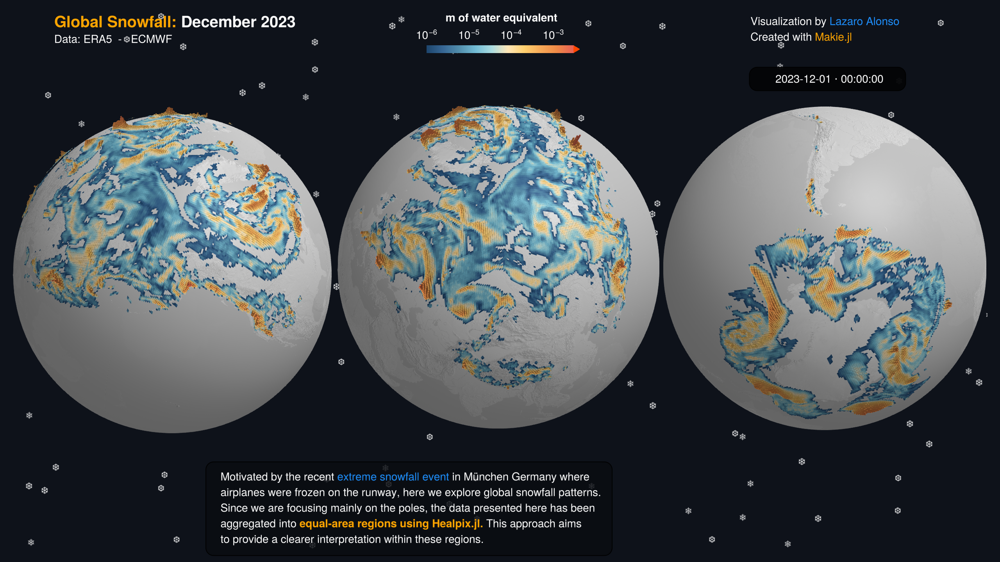

### [EGU 2025](https://www.egu25.eu)
# [Introduction and showcase of Julia for Geoscience](https://meetingorganizer.copernicus.org/EGU25/session/53623)

   

*Fig: global snowfall map, see [code](https://github.com/lazarusA/LittlePieces/blob/main/snowfall_healpix/snowfall_healpix.jl).*

[Julia](https://julialang.org) offers a fresh approach to scientific computing, high-performance computing and data crunching. Recently designed from the ground up Julia avoids many of the weak points of older, widely used programming languages in science such as Python, Matlab, and R. Julia is an interactive scripting language, yet it executes with similar speed as C(++) and Fortran. Its qualities make it an appealing tool for the geo-scientist.

Julia has been gaining traction in the geosciences over the last years in applications ranging from high performance simulations, data processing, geostatistics, machine learning, differentiable programming to general modelling. The Julia package ecosystem necessary for geosciences has substantially matured, which makes it readily usable for research.

This course provides a show case of some cool geo-applications and a hands-on introduction to get you started with Julia. We aim to give a broad overview of Julia, applications in geoscience, its ecosystem as well as going through hands-on coding exercises. Topics are:
- Why Julia is an interesting language for science
- Showcase of cool geoscience applications
- Learn the basics of Julia to get you started in a hands-on session

Organizers: Mauro Werder, Ludovic Räss, Lazaro Alonso, Simone Silvestri, Milan Kloewer

## Content

1) Introduction presentation about Julia ([slides](https://mauro3.github.io/EGU2025-Julia-intro-and-showcase-for-geoscience/intro-presentation.slides.html))
2) Showcases of:
    - Visualisation of Geo-Data using the plotting library Makie.jl and various geodata libraries; see [visualization-of-geodata](./visualization-of-geodata)
    - Global ocean modelling with Oceananigans.jl on CPUs and GPUs; see [global-ocean-notebooks](./global-ocean-notebooks)
    - Interactive atmospheric modelling with SpeedyWeather.jl; see [speedyweather](./speedyweather)
    - Inverse ice flow modelling and data integration using automatic differentiation on GPUs with Glaide.jl; see [glacier-inverse-modelling](./glacier-inverse-modelling)
3) Hands-on exercise to get you started with Julia (see [below](https://github.com/mauro3/EGU2025-Julia-intro-and-showcase-for-geoscience/tree/main?tab=readme-ov-file#running-notebooks-on-google-colab))
    - If you have some Julia experience you can also dive into the notebooks of above showcases

## Running notebooks on Google Colab

Open the hands-on notebook `julia-basics.jl` in Colab with
- [https://Colab.research.google.com/github/mauro3/EGU2025-Julia-intro-and-showcase-for-geoscience/blob/main/intro-notebooks/julia-basics.ipynb](https://Colab.research.google.com/github/mauro3/EGU2025-Julia-intro-and-showcase-for-geoscience/blob/main/intro-notebooks/julia-basics.ipynb)
- save an editable personal copy; in the menu "File" -> "Save a copy in Drive"
- open the personal copy
- in the menu "Runtime" -> "Change runtime type" -> "Julia" (⚠️ leaving it at "Julia v1.11.5" does not work)
- there is also a [solution notebook](https://github.com/mauro3/EGU2025-Julia-intro-and-showcase-for-geoscience/blob/main/intro-notebooks/solution/julia-basics.ipynb) with all the missing bits filled in: [Colab link](https://Colab.research.google.com/github/mauro3/EGU2025-Julia-intro-and-showcase-for-geoscience/blob/main/intro-notebooks/solution/julia-basics.ipynb)

The showcase notebooks can be opened with:
- Google Colab
- VScode with Julia kernel for notebook support
- JupyterHub or server that supports Julia kernel, using e.g. [IJulia](https://github.com/JuliaLang/IJulia.jl)

> [!WARNING]
> Make sure to edit a personal copy of the Colab notebook ("File" -> "Save a copy in Drive") and to select the `Julia` runtime (instead of `Julia 1.11.5`); "Runtime" -> "Change runtime type" -> "Julia").

> [!NOTE]
> For some of the notebooks GPU acceleration is useful, for this select the "T4 GPU" option.

## Installing and running notebooks on your own hardware

- Install Julia (probably version 1.11 or the long term stable 1.10): for all operating systems it is best is to use "juliaup": https://github.com/JuliaLang/juliaup
- To install the Julia kernel for Jupyter, follow [https://github.com/JuliaLang/IJulia.jl](https://github.com/JuliaLang/IJulia.jl)
- Clone or download this repository
- Start Jupyter from within one of the notebook folders such that it picks up the installed packages (defined in `Project.toml`). You may need to run `using Pkg; Pkg.update()` in the notebook to get the packages actually installed.
